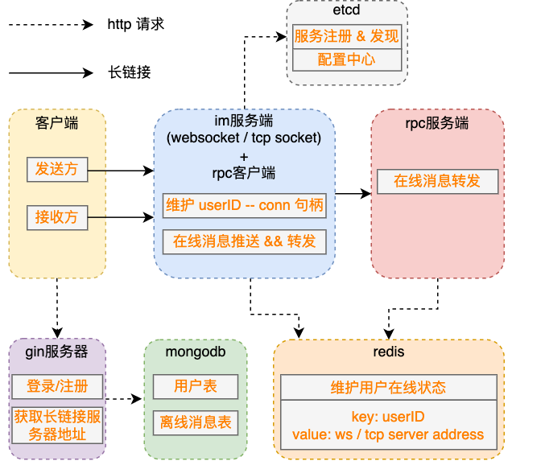
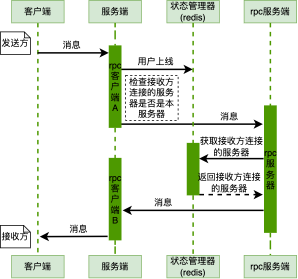

# im

#### 整体架构
| 角色                                       | 机器数量 | 功能                                     |
|:-----------------------------------------|:-----|:---------------------------------------|
| http 服务器                                 | 多台   | 处理注册/登录、文件上传等业务                        |
| websocket 服务器 + rpc 客户端（与 rpc 服务端保持长链接）  | 多台   | 处理聊天业务                                 |
| tcp-socket 服务器 + rpc 客户端（与 rpc 服务端保持长链接） | 多台   | 处理聊天业务                                 |
| rpc 服务器（与 rpc 客户端保持长链接）                  | 1台   | 处理消息转发业务                               |
| redis 状态管理服务器                            | 1台+  | 管理用户 & websocket / tcp-socket 服务器的在线状态 |
| mongodb                                  | 1台+  | 存储用户信息、离线消息等                           |
| etcd 服务发现与负载均衡服务器                        | 1台+  | 服务注册/发现 & 负载均衡                         |

### 设计图
#### 项目架构图

#### 流程图

### 技术细节
1. gin - 处理注册/登录、图片上传、选择可用的 websocket / tcp-socket 服务器等业务
2. websocket 服务器 + rpc 客户端 - 在线消息转发
3. rpc 服务器，处理 websocket / tcp-socket 服务器之间的转发业务
4. tcp-socket 服务器 + rpc 客户端 - 在线消息转发
5. etcd：服务注册与发现，websocket / tcp-socket 服务器负载均衡
6. redis：用户在线状态管理 && 记录在线用户与 websocket / tcp-socket 服务器的映射关系
7. mongodb：存储用户信息、用户离线消息等
8. 不丢消息（ACK 机制）
9. 不重复（消息添加全局唯一递增 ID）
10. 不乱序（1.消息添加全局唯一递增 ID，客户端记录 lastID；2.上线时先推送离线消息，再将用户状态改为 online）
11. 消息安全性（user_relations 表保存 userA 和 userB 之间的 AES 密钥）
12. 离线消息存储（msg_type:消息类型(chat/ack)、to_user_id:接收消息的用户ID、has_read:是否已读）
13. 防止离线消息重复推送（UPDATE `im_offline` SET has_read = true WHERE id = ${msg_id} AND has_read = false）
14. 使用 etcd 制作配置中心
15. 接入 zipkin（链路追踪）
